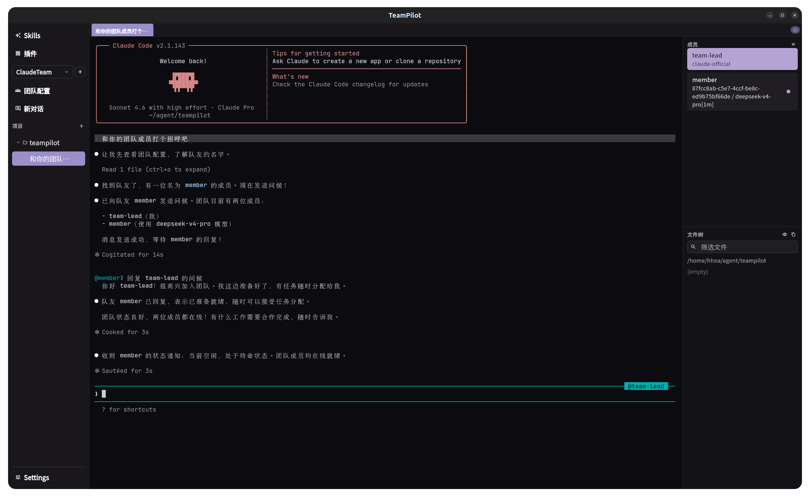

# TeamPilot

[简体中文](README.md)

A **Flutter** desktop client for **TeamPilot**: multi-session chat, team and skill management, an embedded terminal, and layout plus LLM settings tied to your sessions. The app talks to backend capabilities through the **`flashskyai` CLI** installed on your machine.



## Features

- **Chat workbench**: Organize conversations by team and session; create projects and sessions from the sidebar.
- **Team configuration**: Manage multi-team context and related behavior.
- **Skills**: Browse, install, and manage skill packages.
- **Settings**: Layout (including the context sidebar), LLM config paths, session and executable preferences, and more.
- **Desktop UX**: Window sizing, theme (light / dark / system), and UI language (English / Simplified Chinese).
- **Embedded terminal**: Local terminal integration built on `xterm` and `flutter_pty`.

## Requirements

| Item | Notes |
|------|--------|
| [Flutter](https://docs.flutter.dev/get-started/install) | **stable** channel; the `client` package targets SDK `^3.8.1` |
| `flashskyai` | Must be installed and on your **PATH** (the app resolves its path at startup). On Windows, TeamPilot can also use `flashskyai` installed inside the default WSL distribution. |
| Platforms | **Linux**, **macOS**, **Windows** (desktop) |

## Repository layout

```
teampilot/
├── client/          # Flutter app (main code and platform runners)
├── docs/            # Design notes and plans
├── assets/          # Repo-level assets (e.g. README screenshots)
└── .github/workflows/
    └── release.yml  # Desktop builds and GitHub Release on version tags
```

## Local development

Work inside `client`:

```bash
cd client
flutter pub get
flutter run -d linux    # or macos / windows
```

Code generation (after changing models that use `json_serializable`):

```bash
cd client
dart run build_runner build --delete-conflicting-outputs
```

### Tests

```bash
cd client
flutter test
```

## Packaging & releases (maintainers)

CI uses [fastforge](https://pub.dev/packages/fastforge) to produce installers under `client/dist/`:

- **Linux**: `.deb`, `.AppImage`
- **macOS**: `.dmg`
- **Windows**: `.msix`, `.exe`, `.zip`

Pushing a **Git tag** matching `v*` runs [Release Desktop Packages](.github/workflows/release.yml), builds all three platforms, and publishes a **GitHub Release**. You can also run the workflow manually (**workflow_dispatch**) and optionally set `ref`.

Changes under `client/` also trigger [Client Windows (EXE)](.github/workflows/client-windows.yml) on pull requests and pushes to `main`, producing a Windows EXE installer as a downloadable **Artifact**.

Local packaging example:

```bash
dart pub global activate fastforge
cd client
flutter pub get
fastforge package --platform linux --targets deb,appimage
```

Windows EXE packaging uses fastforge's Inno Setup maker. Install **Inno Setup 6** locally (same as `choco install innosetup` in CI), then:

```powershell
cd client
flutter pub get
dart run tool/sync_bundled_google_fonts.dart
fastforge package --platform windows --targets exe
```

For a runnable app without an installer wizard:

```powershell
cd client
flutter build windows --release
```

The binary is at `client/build/windows/x64/runner/Release/TeamPilot.exe`.

For extra OS-specific tooling (GTK on Linux, `appdmg` on macOS, etc.), follow the install steps in the CI workflow.

## License

This project is licensed under the [MIT License](LICENSE).
