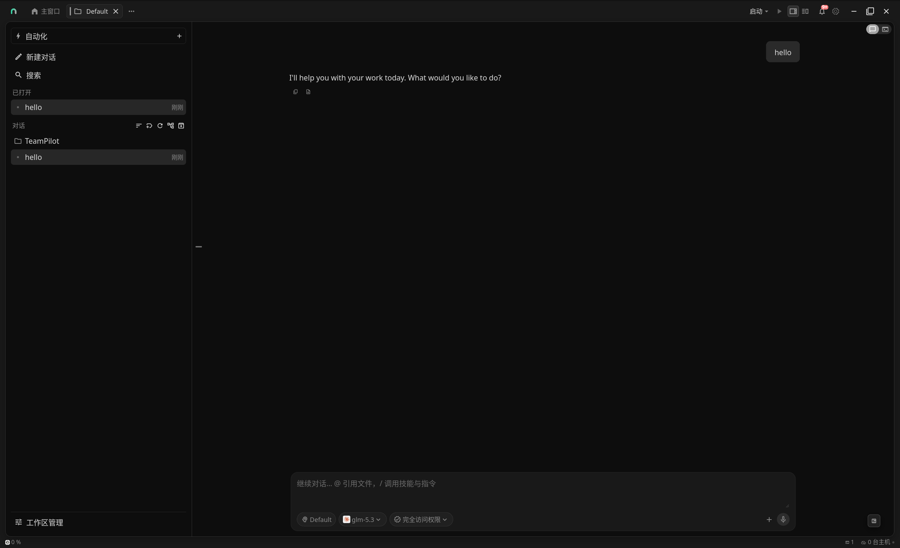
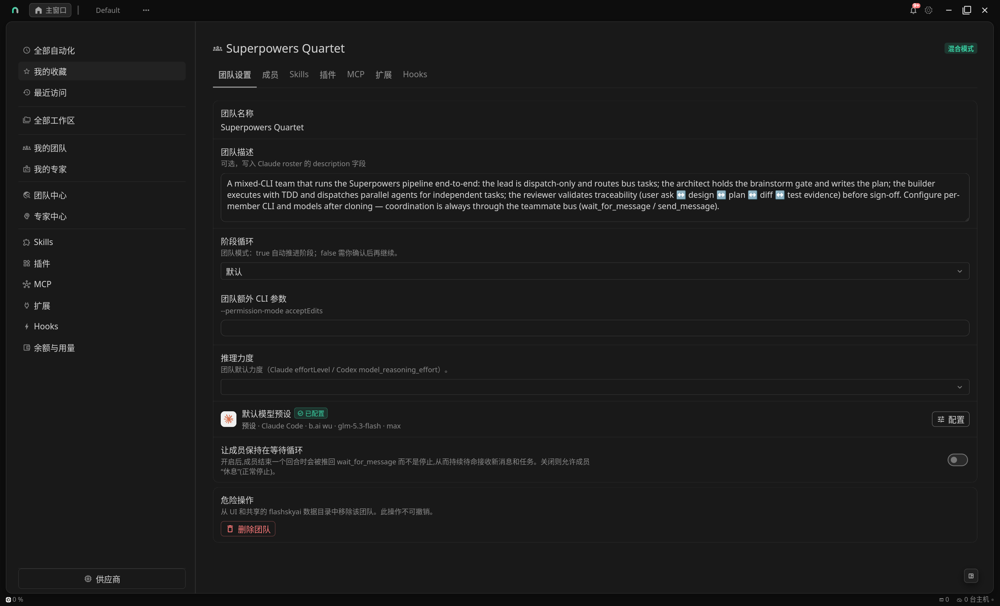
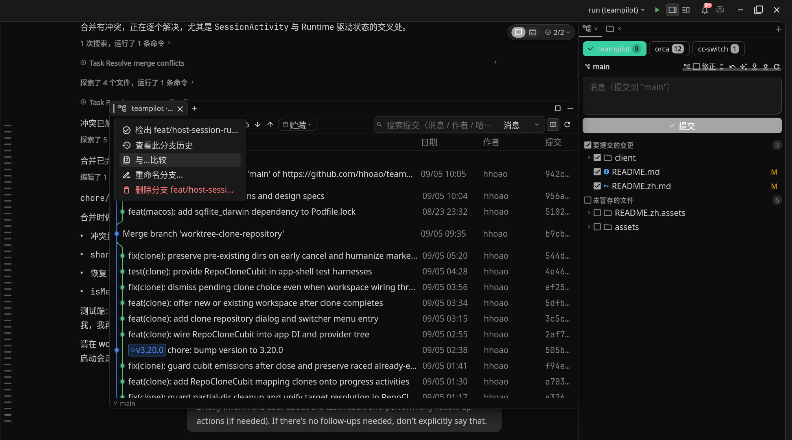
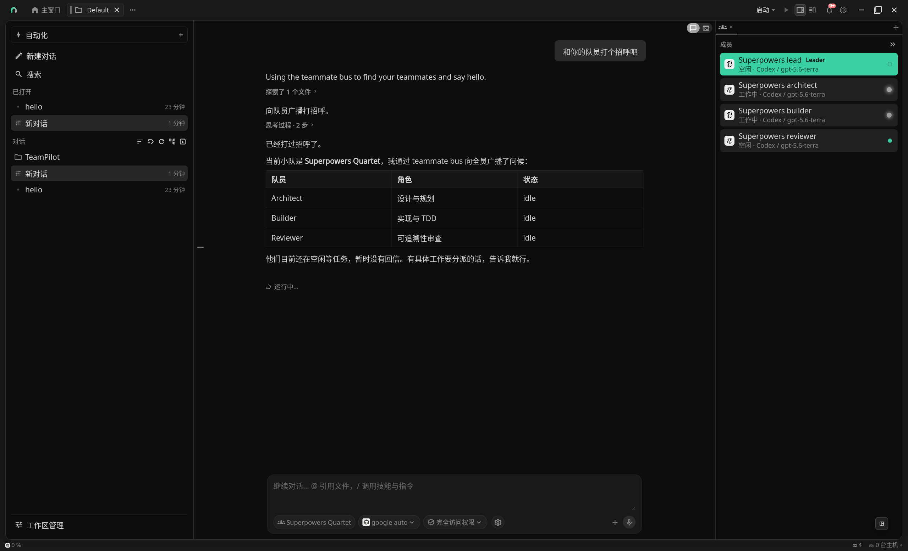
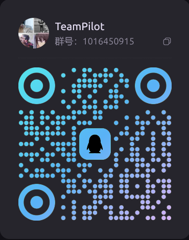

# TeamPilot

<p align="center">
  
</p>


<p align="center">
  <a href="README.zh.md">简体中文</a> •
  <a href="#core-features">Core Features</a> •
  <a href="#installation">Installation</a> •
  <a href="#supported-clis">Supported CLIs</a> •
  <a href="#development">Development</a> •
  <a href="#license">License</a> •
  <a href="#community">Community</a>
</p>

<div align="center">
  <a href="LICENSE"></a>
  <a href="https://github.com/hhoao/teampilot/releases"></a>
  <a href="https://github.com/hhoao/teampilot/stargazers"></a>
  <a href="https://github.com/hhoao/teampilot/actions/workflows/client-verify.yml"></a>
  <br>
  <a href="https://github.com/hhoao/teampilot/releases"></a>
  <a href="https://github.com/hhoao/teampilot/releases"></a>
  <a href="https://github.com/hhoao/teampilot/releases"></a>
  <a href="https://github.com/hhoao/teampilot/releases"></a>
  <a href="https://qm.qq.com/"></a>
  <a href="https://discord.com/channels/1518523215767666719/1518523216912449669"></a>
</div>
**TeamPilot** is an easy-to-use, cross-platform (including mobile) agent workbench that integrates mainstream agent CLIs (Claude Code, Codex, etc.). It works as a conversational assistant and as a full-featured agent-driven IDE. It wraps a UI layer over today's popular agent CLIs: chat transcripts become visual, and config files are isolated across multiple layers. It manages global agent-CLI capabilities as well as workspace-specific Skills, MCP, and Hooks in one place, lets you configure multiple providers per CLI so every session can quickly use any custom model from any CLI, and adds unique expert assistants plus the ability to coordinate multiple agent CLIs across machines — giving anyone highly convenient, customizable conversations.





## Core Features

### One agent client, every platform

Today's agent CLIs — Codex, Claude Code, and the rest — are richest on the desktop, while their mobile offerings are mostly chat-only. TeamPilot is built with Flutter and abstracts multiple filesystem implementations internally, so you get the same full feature set on desktop and mobile.

### Multi-CLI capability abstraction and isolation

TeamPilot's multi-CLI abstraction turns the Skills, MCP, Hooks, and plugin management of different agents into a visual management UI — install and enable a capability once, then use it from any CLI while chatting. TeamPilot also configures multiple providers and credentials per agent CLI, so users with several accounts or provider APIs can switch models instantly and stay focused on development.

### A full-featured agent development environment

TeamPilot provides the usual agent-IDE capabilities, including but not limited to: agent usage monitoring, automations, post-task notifications, a file tree and code editor, source control (Git commit graph, viewing commit info, committing, cross-branch file-diff comparison), workspaces, session content search, a code/doc reading editor, terminal tools, quick launch, and more.

<p align="center">
  
</p>

### An easy-to-use interface

Every agent CLI runs only in a terminal, which is hard to operate and offers a poor user experience — and juggling multiple CLIs leaves you exhausted from switching. TeamPilot integrates the popular agent CLIs into one UI so you can develop with more focus and efficiency.

### Expert assistants

Default agent setups rarely match the skills real-world experts bring, and Skills, prompts, and MCP are hard to configure and switch quickly. TeamPilot provides expert configuration: define multiple powerful, unique experts, and when enabled each applies to the current chat session without conflicting with others — switch between them instantly while chatting.

### Multi-agent-CLI expert team collaboration

Using a single model throughout either burns premium tokens on trivial edits or underpowers planning and cross-module verification. TeamPilot lets **each member bind its own model tier**, running agents of different intelligence / speed / cost in parallel within one team:

A team is composed of multiple experts, each **independently** specifying its CLI, model, provider, system prompt, launch flags, and machine. While chatting, each member has its own context and configuration, and they communicate with each other to get the work done.



### High performance

TeamPilot is built with Flutter and optimized internally — every click stays silky, every session starts fast, and the UI remains smooth even after a thousand conversation turns.

### Complete remote development capability

TeamPilot supports remote conversations in many scenarios: connect to a remote environment over SSH right from the mobile app at startup; keep multiple SSH profiles and pick one when creating a workspace for remote development; mix local and remote folders in the same workspace and switch environments mid-conversation; or configure a team so local and remote members develop together.

### Extensibility (work in progress)

RTK, CodeGraph

## Installation

Open the latest [GitHub Release](https://github.com/hhoao/teampilot/releases) and download the asset for your system (names look like `teampilot-<version>-…`).

### Linux

**Debian / Ubuntu (`.deb`, recommended)**

```bash
sudo dpkg -i teampilot-*-linux.deb
# If dependencies are missing:
sudo apt install -f
```

Launch **TeamPilot** from the app menu after installing. Uninstall: `sudo apt remove teampilot` (exact package name is in the deb metadata).

**AppImage (portable)**

```bash
chmod +x teampilot-*-linux.AppImage
./teampilot-*-linux.AppImage
```

### macOS

1. Download `teampilot-*-macos.dmg`.
2. Open the DMG and drag **TeamPilot** into **Applications**.
3. If Gatekeeper blocks the first launch: allow it under **System Settings → Privacy & Security**, or right-click the app → **Open**.

### Windows

Pick one installer from the same release (usually all are provided):

| File | Notes |
|------|--------|
| `*-windows-setup.exe` | **Recommended**: Inno Setup wizard, creates shortcuts automatically |
| `*.msix` | For sideloading / managed deployment environments |
| `*.zip` | Portable: extract and run `TeamPilot.exe`, no registry writes |

If your CLI lives in **WSL**, point app data or the CLI path at WSL in settings; you can also configure **SSH** in settings to reach a remote Linux dev box.

### Android

Android does **not** run a local PTY — connect over **SSH** to a Linux/macOS/Windows (WSL) host that already has your target agent CLI installed.

1. Download `teampilot-*-arm64-v8a.apk` (most newer phones) or `teampilot-*-armeabi-v7a.apk` per your CPU architecture.
2. Allow installs from unknown sources, then install the APK.
3. Open the app and configure SSH host, user, and key (or password) under **Settings**.
4. Make sure the CLI is installed on the remote and works in the shell you get after SSH login.

## Supported CLIs

| CLI | Terminal sessions | Provider config | Notes |
|-----|-------------------|-----------------|-------|
| **Claude Code** | ✅ | ✅ | Default team CLI; onboarding can detect/install. |
| **Codex** | ✅ | ✅ | Launchable; joins mixed teams via the team bus. |
| **opencode** | ✅ | ✅ | Config via `OPENCODE_CONFIG_DIR`. |
| **cursor** | ✅ | ✅ | `cursor-agent`; HOME isolated per member. |
| **flashskyai** | ✅ | ✅ | Path auto-detected at app startup. |


## Development

| Doc | Audience | Topic |
|-----|----------|-------|
| [Development guide](docs/DEVELOPMENT.md) | Contributors / maintainers | Setup, run, test, packaging, CI |
| [AGENTS.md](AGENTS.md) | Contributors / AI | Repo layout, architecture conventions |


## References

* Embedded terminals use **[flutter_alacritty](https://github.com/hhoao/flutter_alacritty)** — a Flutter widget backed by an Alacritty-based Rust engine.


## Acknowledgements

- File icons: [Material Icon Theme](https://github.com/material-extensions/vscode-material-icon-theme) (MIT) by Philipp Kief / material-extensions.


## License

This project is licensed under the [GNU Affero General Public License v3.0](LICENSE).


## Community

- **QQ Group**：[112856301](https://qm.qq.com/q/ScSC18EPaE)

- **Discord**：[Join the server](https://discord.com/channels/1518523215767666719/1518523216912449669)

  

<p align="left">
  
</p>

Questions, usage tips, and feedback are welcome.
