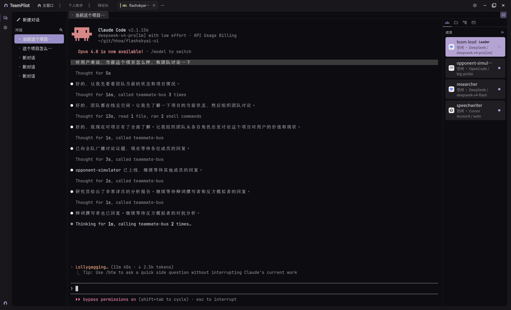

# TeamPilot

[English](README.md) · [开发指南](docs/DEVELOPMENT.md) · 架构与 AI 约定见 [AGENTS.md](AGENTS.md)

**TeamPilot** 是基于终端 AI Agent 封装的面向团队易用的桌面客户端。它的核心是 **团队能力**：在 GUI 里为每位成员单独指定模型、提示词、乃至不同的 CLI，按角色分档协作（省 Token、快实现、准验收），并一键为每个成员启动独立内嵌终端，通过本机或远程的 Claude Code、Codex、opencode、cursor、flashskyai 等 CLI 与 Agent 协作；项目与会话则负责把这套团队绑定到具体仓库与对话上。




## 两种用法

| 模式 | 适用场景 | 你得到什么 |
|------|----------|------------|
| **简单模式**（个人） | 只想在某个仓库里跑一个 Agent | 跳过组队——直接拉起**单个 CLI** 开聊，无需搭建成员名册。 |
| **团队模式** | 多 Agent / 分档协作 / 混合 CLI | 先配好团队，再**每个成员一个终端**并行工作。这是 TeamPilot 的核心能力（见下文）。 |

**简单模式不是阉割版。** 个人项目同样拥有完整的项目级配置，只是省去了多成员名册：

- **多 CLI、多模型，可随时切换。** 每个 CLI（Claude Code、Codex、opencode、cursor、flashskyai）在项目里各自保存**自己的 Provider + 模型 + 推理力度（effort）**，所以可以为每个工具配置多套模型、随时切换当前 CLI/模型，无需改全局设置——单 Agent 也能享受和团队一样的分档收益。
- **CLI 预设**：把常用 CLI + 模型组合保存为具名预设，一键切换。
- **逐项目的 Agent、技能、插件、MCP、扩展**——个人项目自带提示词与能力集；技能 / MCP / 插件在全局库安装一次，各 CLI 共用。
- **一个永久内置的 *个人助手* 项目**，加上你新建的任意个人项目，都与团队项目并列摆放——先用简单模式起步，等任务需要时再升级成团队。

## 核心功能：团队配置

团队配置是 TeamPilot 与「单终端 + 手写参数」方式的根本区别——**先配好团队，再在聊天工作台里按成员并行工作**。

| 配置项 | 作用 |
|--------|------|
| **团队** | 一套完整的多 Agent 方案：选择协调模式（单 CLI 的 **native** 原生团队，或跨 CLI 的 **mixed** 混合团队）、团队级参数，并绑定该团队专用的技能与插件。 |
| **成员** | 团队内的角色（如 `team-lead`、开发者、审查者）：**各自独立**指定模型、Provider、系统提示词与启动参数——在混合模式下还可指定各自的 CLI；连接会话时为**每位成员单独 spawn 一个 PTY 终端**，模型与上下文互不混用。 |
| **技能 / 插件** | 按团队挂载能力扩展；启动时写入该团队隔离的 CLI 配置目录，成员终端自动继承。 |

### 按成员隔离模型：省 Token、分档协作

若全程只用一个模型，往往要么在简单改动上浪费高价 Token，要么在方案与跨模块核对上力不从心。TeamPilot 让**每个成员绑定自己的模型档位**，在同一团队里并行跑不同「智商 / 速度 / 成本」的 Agent：

| 角色示例 | 常见模型档位 | 适合做什么 |
|----------|--------------|------------|
| 统筹 / 方案 | 高级（如 Opus、旗舰档） | 拆需求、写技术方案、定边界与验收标准 |
| 实现 | 轻量 / 快速（如 Haiku、小模型） | 按方案批量改代码、补样板、跑通主路径 |
| 审查 | 中级（如 Sonnet） | Code review、对照方案查漏、跨文件 / 跨模块一致性 |

这不限于写代码：文档起草、调研汇总、运维排障等**任意多步流水线**都可以这样拆——用强模型把需求「想清楚、写清楚」，用轻模型「快执行」，用中级模型「验结果、对齐跨领域约束」，在控制成本的同时加快落地，也更易**精准完成跨模块、跨职能的复杂需求**（而不必让同一个会话又当架构师又当苦力又当质检）。

**典型用法：**

- **模型分档**：为 `team-lead`、实现位、审查位分别配置不同 Provider / 模型；切换成员标签即切换终端与模型，无需反复改全局设置。
- **分工协作**：`team-lead` 负责统筹与委派（Claude Code 要求存在名为 `team-lead` 的成员），其他成员承担实现、审查等子任务，在同一窗口内切换终端即可。
- **混合 CLI**：在 **mixed** 团队中，成员可运行不同的 CLI（Claude Code、Codex、opencode、cursor、flashskyai），并通过进程内消息总线协调——让每个工具各尽所长。
- **场景切换**：为「日常开发」「深度重构」「文档撰写」各建一个团队，换任务时切换团队，无需重配模型与提示词。也可从内置 **Team Hub** 浏览并导入可分享的团队模板。
- **与会话联动**：打开项目会话时，TeamPilot 将当前团队注入启动参数（如 `--team-name`、每位成员的会话 id、独立 `CONFIG_DIR`），并支持恢复历史 CLI 会话。

设置入口：**设置 → 团队配置**（路由 `/team-config`）。团队 JSON 保存在应用数据目录的 `teams/` 下；每位成员的运行时 CLI 配置隔离在 `config-profiles/teams/<团队>/members/…`。

## 工作区与内置 IDE

TeamPilot 不只是「多开几个 Agent 终端」——同一个窗口里就能完成常见的仓库浏览、改文件、看 diff、提交 Git，并与内嵌终端并排使用。工作区侧栏按 **worktree** 分组会话；右侧工具栏提供文件树、源代码管理、成员与邮箱等面板，减少在 IDE 与终端之间来回切换。

### Git Worktree

在绑定 Git 仓库的工作区里，TeamPilot 原生支持 **git worktree** 工作流（桌面本机 / WSL；SSH / Android 端不提供创建与删除）：

| 能力 | 说明 |
|------|------|
| **按分支分组** | 侧栏会话按 worktree 折叠分组；选中某一分支即切换当前工作目录，文件树与 Git 面板随之跟随。 |
| **创建 worktree** | 从主仓库派生新分支或检出已有分支；目录默认落在应用数据下的 `worktrees/<仓库名>/<分支>`，也可在对话框中调整路径。 |
| **删除 worktree** | 支持强制删除（有未提交改动时）、可选同时删除分支、可选一并删除该 worktree 下的会话。 |
| **一键开聊** | 创建时可勾选「创建后在此开始一个会话」，在新 worktree 里直接拉起 Agent。 |

适合并行开发多个功能分支、或在不影响主工作区的前提下让不同 Agent 会话各自占用独立检出目录。

### CLI 预设

**预设**把「用哪个 CLI + 哪套 Provider / 模型 / 推理力度」保存成可复用的具名方案，避免每次开聊重复点选：

| 场景 | 用法 |
|------|------|
| **个人工作区** | 在 **Agent** 配置页选择**当前预设**；预设决定默认 CLI 与模型档位，仍可配合「每个 CLI 各自保存 Provider + 模型 + effort」做细调。 |
| **团队** | 团队可为成员指定**默认预设**；native 模式下预设通常锁定团队 CLI，mixed 模式下可为不同成员配置不同 CLI 的预设。 |
| **管理** | **管理预设**对话框集中新建、编辑、删除；每条预设包含名称、CLI、Provider、模型与 effort。 |

典型做法：为「日常小改」「深度方案」「廉价批量实现」各建一条预设，换任务时一键切换，而不必改全局 Provider 设置。

### 技能 / MCP / 插件：全局库 + 跨 CLI 复用

能力资源采用**两层结构**——先在应用级**全局库**安装与启用，再在工作区 / 团队身份上**勾选挂载**；启动会话时 TeamPilot 按目标 CLI 的格式写入各自隔离的配置目录，**同一份勾选列表**可复用到 Claude Code、Codex、opencode、cursor、flashskyai 等全部支持的 CLI：

| 层级 | 作用 |
|------|------|
| **全局库** | 在主页侧栏或 `/skills`、`/plugins`、`/mcp` 集中浏览、安装、启用技能、插件与 MCP 服务器定义。 |
| **身份 / 工作区挂载** | 个人身份或团队身份的 `ConfigBundle` 记录要启用的 `skillIds` / `pluginIds` / `mcpServerIds`；个人与团队工作区配置页均可勾选子集。 |
| **按 CLI 下发** | 各 CLI 通过注册表内的专用 writer / provisioner 生成对应格式（如 Claude 形 `mcpServers`、Codex TOML、opencode 配置目录等），成员终端启动时自动继承。 |

因此：**库只维护一份**，不必为每个 CLI 重复安装同一套 MCP；换 CLI 或开混合团队时，只要在身份上勾选同一组能力，落地配置由 TeamPilot 按工具分别生成。扩展（Extensions）另有独立安装与启用流程，按身份 id 关联。

### 内置 IDE 能力

右侧工具栏与编辑区提供常见 IDE 能力，与 Agent 终端共享同一工作目录，磁盘变更会联动刷新文件树与 Git 状态（本机 / WSL 实时监听；SSH 端在 Agent 回合结束等时机轮询刷新）：

| 模块 | 能力 |
|------|------|
| **文件树** | 浏览工作区目录；支持多根文件夹（VS Code 式折叠头）、过滤、新建文件/文件夹、复制/剪切/粘贴、重命名、删除、复制路径、用系统应用打开、**定位当前编辑文件**。 |
| **代码编辑器** | 基于 **re-editor** 的多标签内嵌编辑器；从文件树或 Git diff 打开文件，未保存改动有脏标记，关闭前提示保存。 |
| **源代码管理（Git）** | VS Code 风格的变更列表：暂存 / 取消暂存、按文件或目录暂存、放弃更改、分支切换、内联 **diff 视图**（语法高亮与行间导航）、填写提交说明并 **提交**；可对暂存变更用 ✨ **AI 生成提交说明**（可在设置中配置）。 |
| **工作区搜索** | 侧栏搜索入口：同时检索会话标题与仓库内文件内容，快速跳转到对应对话或文件。 |
| **团队协作面板** | 团队模式下还可打开**成员**列表、**邮箱**（TeamBus 消息）与**看板**（混合团队任务状态，点击卡片可跳到对应成员终端）。 |

个人工作区默认展示文件树与 Git；团队工作区在此基础上增加成员、邮箱、看板等协作视图。

## 为什么选择 TeamPilot？

### 技能与插件

- **技能（Skills）**：在**全局库**安装与启用；挂载到个人身份或团队后，该身份下所有成员终端共享同一套能力。
- **插件（Plugins）**：可视化安装与管理；在工作区 / 团队配置中勾选要启用的插件，启动时写入各 CLI 对应目录，减少成员间环境不一致。

### 聊天与工作台

- **多标签终端**：多个成员 / 会话放在一个窗口里推进，少开一堆系统终端。
- **项目与会话**：按仓库和对话整理记录，并把**当前选中的团队**绑定到该次工作。
- **自动会话标题**：侧栏一眼看出每条对话在聊什么。
- **右侧工具栏**：文件树、Git、成员列表与提示词就在聊天旁，减少来回切换。

### 设置与集成

- **RTK（可选）**：可在设置中开启，帮助压缩会话占用、延长可用上下文。

## 安装

在 [GitHub Releases](https://github.com/hhoao/teampilot/releases) 打开最新版本，按系统下载对应文件（文件名形如 `teampilot-<版本>-…`）。

### Linux

**Debian / Ubuntu（`.deb`，推荐）**

```bash
sudo dpkg -i teampilot-*-linux.deb
# 若提示依赖缺失：
sudo apt install -f
```

安装后从应用菜单启动 **TeamPilot**。卸载：`sudo apt remove flashskyai-client`（包名以 deb 元数据为准）。

**AppImage（免安装）**

```bash
chmod +x teampilot-*-linux.AppImage
./teampilot-*-linux.AppImage
```

需要 `libfuse2`（Ubuntu 22.04+ 常需 `sudo apt install libfuse2`）。若希望写入开始菜单 / Dock，可配合 [AppImageLauncher](https://github.com/TheAssassin/AppImageLauncher)。

桌面端默认在本机以 PTY 直接启动 Agent CLI 终端；也可在设置中改用 **SSH** 连接远端主机（CLI 在远端运行）。

### macOS

1. 下载 `teampilot-*-macos.dmg`。
2. 打开 DMG，将 **TeamPilot** 拖入「应用程序」。
3. 首次启动若被 Gatekeeper 拦截：「系统设置 → 隐私与安全性」中允许，或右键应用 →「打开」。

### Windows

任选一种安装包（同一 Release 中通常都有）：

| 文件 | 说明 |
|------|------|
| `*-windows-setup.exe` | **推荐**：Inno Setup 安装向导，自动创建快捷方式 |
| `*.msix` | 适用于已启用旁加载 / 企业分发的环境 |
| `*.zip` | 便携包：解压后运行其中的 `TeamPilot.exe`，不写注册表 |

若 CLI 安装在 **WSL** 内，可在设置中将应用数据或 CLI 路径指向 WSL；亦可在设置中配置 **SSH** 连接远端 Linux 开发机。

### Android

Android 版**不运行本机 PTY**，需通过 **SSH** 连接已安装目标 Agent CLI 的 Linux/macOS/Windows（WSL）主机。

1. 根据 CPU 架构下载 `teampilot-*-arm64-v8a.apk`（多数新机型）或 `teampilot-*-armeabi-v7a.apk`。
2. 允许「未知来源」后安装 APK。
3. 打开应用，在 **设置** 中配置 SSH 主机、用户与密钥（或密码）。
4. 确保远端已安装 CLI 且可在 SSH 登录后的 shell 中执行。

## 支持的 CLI

| CLI | 终端会话 | Provider 配置 | 说明 |
|-----|----------|---------------|------|
| **Claude Code** | ✅ | ✅ | 默认团队 CLI；引导向导可协助检测/安装。 |
| **Codex** | ✅ | ✅ | 可启动；通过消息总线参与混合团队。 |
| **opencode** | ✅ | ✅ | 配置走 `OPENCODE_CONFIG_DIR`。 |
| **cursor** | ✅ | ✅ | `cursor-agent`；按成员隔离 HOME。 |
| **flashskyai** | ✅ | ✅ | 应用启动时自动探测路径。 |

## 使用前准备

完成[安装](#安装)后，在**运行 TeamPilot 的机器**（桌面为本机，Android 为 SSH 所连远端）准备：

| 项目 | 说明 |
|------|------|
| **你的 Agent CLI** | 团队所用的 CLI（Claude Code、Codex、opencode、cursor、flashskyai）已安装且在登录 shell 的 **PATH** 中，或在 **设置 → 会话** 中填写 CLI 绝对路径 |

首次启动可按引导检测 CLI。安装包由 CI 自动构建；从源码编译见 **[开发指南](docs/DEVELOPMENT.md)**。

## 更多文档

| 文档 | 读者 | 内容 |
|------|------|------|
| [开发指南](docs/DEVELOPMENT.md) | 贡献者 / 维护者 | 环境、本地运行、测试、打包与 CI |
| [AGENTS.md](AGENTS.md) | 贡献者 / AI | 仓库结构、数据目录、架构约定 |

## 终端

内嵌终端使用 **[flutter_alacritty](https://github.com/hhoao/flutter_alacritty)** — 一个基于 Alacritty 的 Rust 引擎驱动的 Flutter 组件。

## 致谢

- 文件图标：[Material Icon Theme](https://github.com/material-extensions/vscode-material-icon-theme)（MIT 协议），作者 Philipp Kief / material-extensions。

## 许可证

[MIT License](LICENSE)。

## 社区

| 渠道 | 链接 |
|------|------|
| **QQ 群** | `1016450915` |
| **Discord** | [加入频道](https://discord.com/channels/1518523215767666719/1518523216912449669) |

欢迎反馈问题、交流用法与贡献想法。
