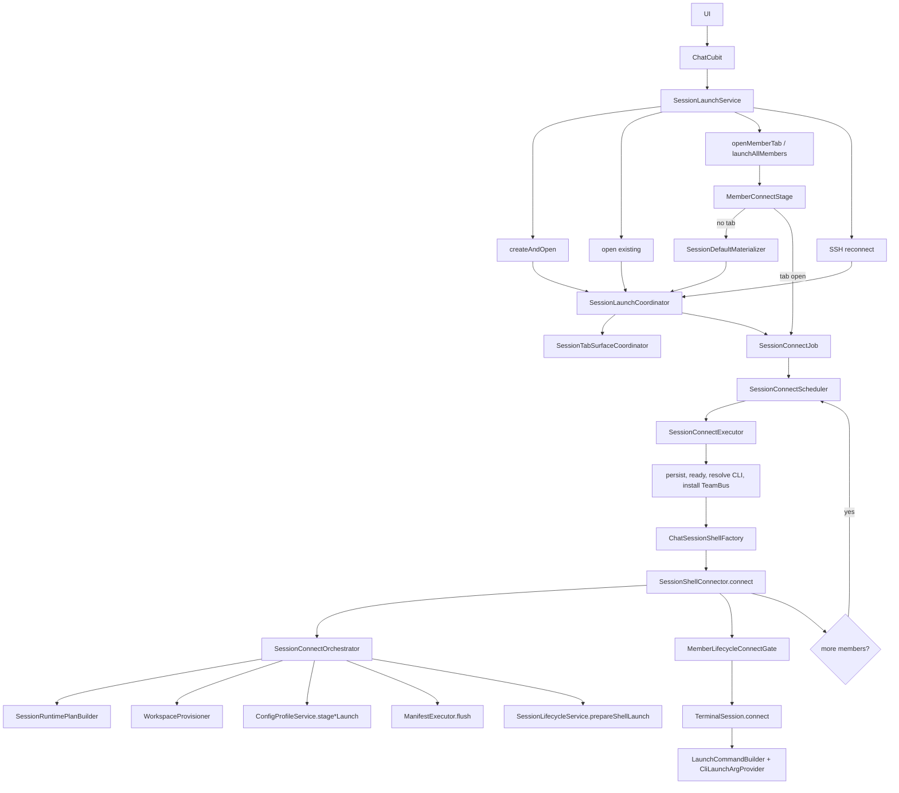

# Architecture

TeamPilot is a Flutter client (`client/`, package `teampilot`). App code lives under `client/lib/`. Layering, file-size, and test conventions: [CODE_QUALITY.md](CODE_QUALITY.md). CLI plugin pattern: [cli-architecture.md](cli-architecture.md). On-disk layout: [workspace-storage-layout.md](workspace-storage-layout.md).

## Core concepts

| Concept | What it is | Persistence |
|---------|------------|-------------|
| **Workspace** | Project container: folders, default team, sessions, workbench layout | `workspace/workspaces/{id}/manifest.json` |
| **Launch profile** | Team identity (`TeamProfile`): roster slots pointing at catalog experts, CLI, skills | `launch-profiles/{id}/profile.json` |
| **Expert** | Catalog persona + capability pack; teams store `expertKey` + optional overrides, not a copy of the prompt | Expert Hub / `member-hub/` |
| **Session** | One running (or resumable) conversation with member bindings and per-seat CLI runtime | `sessions/{sessionId}/session.json` |
| **Simple launch** | Unteamed single-agent session; not a personal launch-identity document | `sessionTeam` empty; optional `expertKey` on the session |

CLI config at connect is layered by `RuntimeLayout` into the session `CONFIG_DIR` (app → identity → workspace → session). Details: [workspace-storage-layout.md](workspace-storage-layout.md#cli-config-inheritance).

## Bootstrap and routing

- Entry: `client/lib/main.dart` → `AppShell` (`client/lib/app/app_shell.dart`) wires cubits, repositories, and services explicitly. No hidden feature singletons.
- Routing: `go_router` in `client/lib/router/app_router.dart`. Home is `/home-v2` (workspace shell). Settings, team config, skills/plugins/MCP/hooks, and providers are sibling routes under the same chrome.
- Storage: inject `HomeStorage` / `RuntimeContextRegistry`. Never `Directory.current` for workspace or app data roots.

## `services/chat/` — team-session product line

`client/lib/services/chat/` is the **team-session lifecycle**, not chat-bubble UI. Pages stay in `pages/chat/` and `pages/home_workspace/`; cubit emit ownership stays on `ChatCubit`.

### Two kinds of directories

Every folder under `services/chat/` is one of:

1. **Logical stage** — a slice of the lifecycle (generate team → launch → live session → conversation).
2. **Complete feature** — a named product capability. Keep the real name (`team_bus`, `team_generation`, `pty`). Do not rename a feature to a stage nickname (`bus`, `generation`).

Subdirectories inside a stage are allowed when they are real steps or nested features. Do **not** flatten `conversation/` onto `chat/` just because the files are “session-related.”

A small **shared** folder is allowed only when several stages need the same session documents or stores (`chat/session/`). Do not dump unrelated code there.

### Stages (flow)

```
team_generation  →  launch  →  runtime  →  conversation
```

| Stage | Path | Owns |
|-------|------|------|
| Generate a team | `team_generation/` | Coordinator, handoff, commit, team-composer MCP. Also a **named feature** — keep this directory name. |
| Launch | `launch/` | Create/open intent, connect, tab attach, staging overlays, workspace provision. Public API stays at the `launch/` root. |
| Live session | `runtime/` | Coordination, presence, idle/reclaim watches. Nested feature: `runtime/pty/`. |
| Conversation | `conversation/` | After the session is up: history, compose, follow-up, prompt delivery, timeline, approvals. Keep these as nested feature folders; do not hoist them to `chat/`. |

### Complete features (keep the name)

| Feature | Path | Notes |
|---------|------|-------|
| TeamBus | `team_bus/` | Mixed-team mailbox, tasks, MCP gateway, roster. Not a stage. |
| Team generation | `team_generation/` | See stages. |
| PTY delivery | `runtime/pty/` | Full-screen TUI paste/submit machine, transports, inject. Nested under the live-session stage. Spec: [pty-fullscreen-delivery.md](pty-fullscreen-delivery.md). |
| Conversation subfeatures | `conversation/{approvals,compose,follow_up,history,prompt_delivery,timeline}/` | Each is a complete concern inside the conversation stage. |

### Shared session types

`chat/session/` holds tab/session stores, open/create DTOs, and ports used by more than one stage (`ChatTab`, `SessionDataStore`, `TabPort`, `SessionRepositoryPort`, …).

This is **not** `launch/session/`. That folder is launch **intent** (create/open coordinator, CLI locks, command builder). The name collision is intentional: different parents, different jobs.

### `launch/` layout

Root of `launch/` is the outward API plus team-settings commit (landing / member-targets), not internals:

- Public API: `session_launch_host.dart`, `session_launch_service.dart`, `launch_factory.dart`, `launch_environment_port.dart`, `session_launch_retry.dart`
- Team settings: `team_settings_commit_service.dart`, `team_lead_delegate_settings_merge.dart`, `team_config_launch_validator.dart`, `member_placement_save.dart`

| Subdir | Owns |
|--------|------|
| `connect/` | Member connect pipeline, shell factory, lifecycle gate, connect types |
| `tab/` | Tab register/reuse/activate, member materializer, TeamBus tab coordinator, input-ready wait |
| `staging/` | Config overlay, runtime plan, launch manifest |
| `workspace/` | Pre-session machine/CLI provision and landing gate |
| `session/` | Create/open intent, persistence writer, launch command / CLI locks |

Do not add one-file “folder types” (`contracts/`, a `tab/` that only holds the surface coordinator). Sink types next to the pipeline that uses them.

### Session launch flow

Two views of the same pipeline: **what happens** (features, including CLI), then **which modules call whom**.

#### Feature flow

```mermaid
flowchart TD
  Start["User: new session / reopen / pick member / SSH reconnect"] --> Valid{"Placement and team valid?"}
  Valid -->|no| Block["Stop: mixed targets or missing member"]
  Valid -->|yes| Tab["Show or reuse the session tab"]

  Tab --> Persist["Write session.json"]
  Persist --> Locks["Pin per-type CLI lock"]
  Locks --> Snap["Snapshot provider / model / preset"]
  Snap --> WhichCli["Resolve this seat CLI: lock then preset then team"]
  WhichCli --> Roster["sessionRosterMembers"]

  Roster --> Mixed{"mixed TeamBus?"}
  Mixed -->|yes| Bus["Start TeamBus + teammate MCP"]
  Mixed -->|no| Plan
  Bus --> Plan["Merge skills / MCP / hooks / plugins: team then expert then workspace"]
  Plan --> Persona["Resolve expert persona into session runtime"]

  Persona --> Remote{"Work machine is SSH or Termux?"}
  Remote -->|yes| Locate["Locate CLI binary on that machine"]
  Locate --> AppData["Copy app data / credentials if opted in"]
  AppData --> WsTree["Provision workspace CLI tree"]
  Remote -->|no| LocalBin["Resolve local CLI executable"]
  WsTree --> Stage
  LocalBin --> Stage

  Stage["Stage CONFIG_DIR: app defaults then identity then workspace then session"]
  Stage --> Mcp["Write MCP: catalog, TeamBus, SSH MCP, extra servers"]
  Mcp --> Hooks["Write hooks"]
  Hooks --> Flush["Flush launch manifest to the work plane"]
  Flush --> Plugins["Install native CLI plugins"]
  Plugins --> AfterFlush["CliSessionCapability.afterManifestFlush"]

  AfterFlush --> Argv["Assemble argv: CliLaunchArgProvider per CLI"]
  Argv --> Gate["CLI session gate: persist / auth / config / ready"]
  Gate -->|blocked or deferred| NoPty["Do not attach PTY"]
  Gate -->|allowed| Pty["Spawn PTY: executable + CONFIG_DIR env"]
  Pty --> Live["Live session: runtime watches"]
  Live --> More{"More members to launch?"}
  More -->|yes| WhichCli
```



CLI capabilities used here: `CliExecutableCapability` (find binary), `CliSessionCapability` (gate + after flush), `CliLaunchArgProvider` (argv), `TeamBehaviorCapability` (native vs mixed), `WorkspaceBaseInfoCapability` (prompt inputs), plus provider / skill / MCP / hook writers under `services/cli/{cli}/`. Config layering: [workspace-storage-layout.md](workspace-storage-layout.md#cli-config-inheritance). Adding a CLI: [cli-architecture.md](cli-architecture.md).

#### Module call graph

All create / open / member / SSH-reconnect paths become one `SessionConnectJob`. The scheduler is the only queue; the executor is the only path that calls `SessionShellConnector.connect()`.



Simple vs team only diverges inside the orchestrator (`prepareSimpleConnect` / `prepareTeamConnect`). After a successful attach, mixed teams may enqueue remaining members on the same scheduler.

### Ports

Ports are outward seams: **the cubit implements, services depend**. Put a port in the **owning feature**, not in a shared `ports/` dump and not re-exported from `SessionLaunchHost`.

| Port | Lives in |
|------|----------|
| `SessionLaunchHost` (plus `SessionConnectStatePort`, `SessionSnapshotPort`, `ChatWorkbenchPort`) | `launch/session_launch_host.dart` |
| `LaunchEnvironmentPort` | `launch/launch_environment_port.dart` |
| `ChatStatePort` | `cubits/chat_state_port.dart` |
| `TabPort`, `SessionRepositoryPort` | `chat/session/` |
| TeamBus `MemberLauncher` | `team_bus/`; launch implements `ChatCubitMemberLauncher` |

Callers of launch import `launch/session_launch_host.dart` (or `session_launch_service.dart` when that file exports the host). Tests import the owning-feature port file, not a host re-export.

### Anti-patterns

- Treating `services/chat/` as UI message widgets (those belong in `pages/` / `packages/ai_message_ui`).
- Renaming `team_bus` / `team_generation` to stage nicknames.
- Flattening `conversation/` or `runtime/pty/` to `chat/` top-level.
- One-file directories, or a fake `ports/` / `contracts/` folder.
- Putting a port next to an unrelated stage because a caller happens to import it.
- Using `launch/session/` and `chat/session/` interchangeably.

## Member placement machines

Always resolve runtime members with `sessionRosterMembers(session, team)` (`client/lib/models/app_session.dart`).

Native writers that stage CLI team files use `cliTeamRosterMembers` / `runtimeRosterMembers` (`client/lib/models/member_instance.dart`).

Never iterate raw `team.members` or expand stale `TeamMemberConfig.replicas` as the session pod list. Placement saves can change replica counts on disk while the in-memory type still says `replicas: 1`; filtering an expand of that type drops numbered pods (`builder-0`, `builder-1`).

## TeamBus

Mixed-mode teams talk through `services/chat/team_bus/`: per-member mail JSONL, task log, idle doorbell, and the teammate-bus MCP gateway. Launch attaches the bus at connect (`launch/tab/tab_team_bus_coordinator.dart`); conversation timeline adapters read mailbox events. Do not fold TeamBus into `launch/` or `conversation/` because those stages call it.

## Where to change code

| Change | Start here |
|--------|------------|
| Team generate / handoff / commit | `services/chat/team_generation/` |
| Create/open session, connect member, launch factory | `services/chat/launch/` (`launch_factory.dart`, then `session/`, `connect/`, `tab/`) |
| Team settings from landing UI | `launch/team_settings_commit_service.dart` |
| Live PTY, paste/submit, inject | `services/chat/runtime/pty/` — [pty-fullscreen-delivery.md](pty-fullscreen-delivery.md) |
| History / compose / follow-up / approvals | `services/chat/conversation/<feature>/` |
| TeamBus mailbox, MCP, roster | `services/chat/team_bus/` |
| Session DTOs, tab store | `services/chat/session/` |
| Chat UI | `pages/chat/`, `pages/home_workspace/` |
| Chat emit / connect state | `cubits/chat_cubit.dart`, `cubits/chat_connect_state_mixin.dart` |
| Add or change a CLI | `services/cli/registry/` + `services/cli/{cli}/` — [cli-architecture.md](cli-architecture.md) |
| Workspace / launch-profile documents | `repositories/`, [workspace-storage-layout.md](workspace-storage-layout.md) |
| Event transport / presence | `services/event/` |
| Workbench splits / tabs | `cubits/workbench/`, `services/workbench/` |
| Generic terminal (workspace shell, not agent CLI) | `services/terminal/` (session still exists; agent PTY lives under `chat/runtime/pty/`) |
| Wire a new service | `app/app_shell.dart` |

## Routes (high level)

Defined in `client/lib/router/app_router.dart`:

| Path | Screen |
|------|--------|
| `/home-v2` | Home workspace shell |
| `/home-v2/workspace/:workspaceId` | Open workspace |
| `/config`, `/config/llm`, `/config/cli`, `/config/ssh-profiles`, `/config/connect`, … | Settings |
| `/team-config` | Team launch identity |
| `/skills`, `/plugins`, `/mcp`, `/hooks`, `/extensions` | Catalog managers |
| `/providers/:cli` | Per-CLI providers |

## Related docs

| Doc | Topic |
|-----|--------|
| [CODE_QUALITY.md](CODE_QUALITY.md) | Layering, file size, tests |
| [cli-architecture.md](cli-architecture.md) | Adding a CLI |
| [pty-fullscreen-delivery.md](pty-fullscreen-delivery.md) | Full-screen TUI submission machine |
| [workspace-storage-layout.md](workspace-storage-layout.md) | On-disk trees |
| [AGENTS.md](../AGENTS.md) | Hard rules for assistants |
