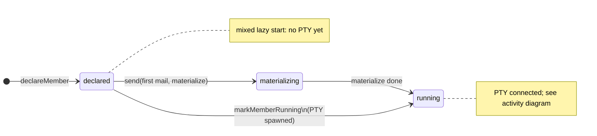
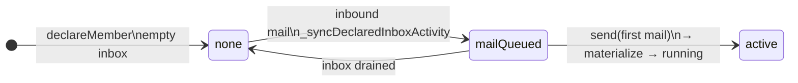
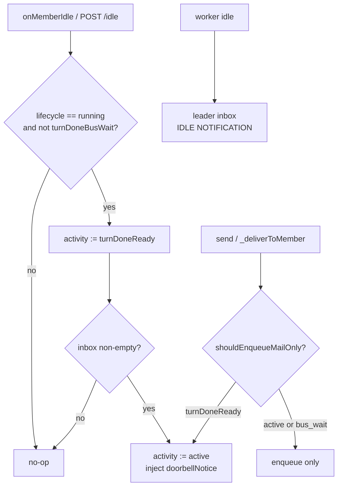

# TeamBus member state machine

In **mixed** team mode, each teammate is an [AgentNode](../client/lib/services/team_bus/agent_node.dart) on [TeamBus](../client/lib/services/team_bus/team_bus.dart) with two orthogonal axes:

| Axis | Type | Meaning |
|------|------|---------|
| **Lifecycle** | [MemberLifecycle](../client/lib/services/team_bus/member_state.dart) | Whether a PTY / process exists |
| **Activity** | [MemberActivity](../client/lib/services/team_bus/member_state.dart) | In-turn vs parked on `wait_for_message` |

Transitions are driven by `TeamBus`, `ChatCubit` PTY callbacks, and MCP `wait_for_message`. Enum definitions live in `client/lib/services/team_bus/member_state.dart`.

中文版：[TEAM_BUS_MEMBER_STATE.md](TEAM_BUS_MEMBER_STATE.md)

## 1. Lifecycle (PTY / roster)

## 2. Activity (while `running`)

```mermaid
stateDiagram-v2
  direction TB
  [*] --> turnDoneReady: markMemberRunning\n(PTY just up)
  turnDoneReady --> active: doorbell wake\n(send while turnDoneReady, etc.)
  turnDoneReady --> turnDoneBusWait: MCP wait_for_message\n(TeamBus.receive entry)
  turnDoneBusWait --> active: waitBatch returns\n(receive finally)
  active --> turnDoneBusWait: wait_for_message again
  active --> turnDoneReady: onMemberIdle\n(Stop hook / terminal idle)\nnot in bus_wait
  turnDoneReady --> active: non-empty inbox +\ndoorbell(doorbellNotice)
  turnDoneReady --> turnDoneReady: onMemberIdle\nempty inbox (no doorbell)
  active --> active: send / deliver\n(enqueue only, no writeln)
  turnDoneBusWait --> turnDoneBusWait: send / deliver\n(enqueue; waiter wakes)
  note right of turnDoneBusWait
    isBusWaitBlocked;
    UI lines via deliverUserCommand
  end note
  note right of turnDoneReady
    acceptsImmediateDoorbell;
    next send can doorbell immediately
  end note
```

## 3. Activity (`declared`, no PTY yet)

## 4. Doorbell and idle edges

**Doorbell policy (current)**

- `wake` + `doorbellNotice` only when the inbox has **unread** mail.
- Empty inbox on `onMemberIdle` → `turnDoneReady` only; **no** stdin coordination nudge.
- Worker idle still delivers `IDLE NOTIFICATION` to the team lead (separate from doorbell).

## 5. Combined lookup (`list_teammates` → `busPhaseLabel`)

| lifecycle | activity | bus.phase |
|-----------|----------|-----------|
| running | active | in_turn |
| running | turnDoneReady | turn_done · ready |
| running | turnDoneBusWait | turn_done · bus_wait |
| declared | mailQueued | no_pty · mail_queued |
| declared | none | offline |

## Related code

| Area | Path |
|------|------|
| Enums & `busPhaseLabel` | `client/lib/services/team_bus/member_state.dart` |
| Transitions | `client/lib/services/team_bus/team_bus.dart` |
| `acceptsImmediateDoorbell`, etc. | `client/lib/services/team_bus/agent_node.dart` |
| MCP tools | `client/lib/services/team_bus/mcp/teammate_bus_mcp_handler.dart` |
| Mixed role prompts | `client/lib/services/session/member_role_provision.dart` |
