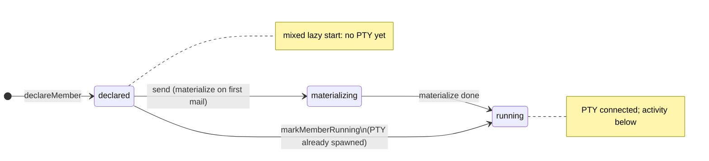

# TeamBus member state machine

In mixed mode each teammate maps to one [AgentNode](../client/lib/services/team_bus/agent_node.dart) inside [TeamBus](../client/lib/services/team_bus/team_bus.dart), described by two orthogonal axes plus a work latch:

| Field | Type | Meaning |
|-------|------|---------|
| **Lifecycle** | [MemberLifecycle](../client/lib/services/team_bus/member_state.dart) | Whether the PTY / process exists |
| **Activity** | [MemberActivity](../client/lib/services/team_bus/member_state.dart) | Whether the CLI is mid-turn / blocked in `wait_for_message` |
| **hasUnreportedWork** | `bool` ([AgentNode](../client/lib/services/team_bus/agent_node.dart)) | Whether it has work that was dispatched to it but not yet reported done to the leader |

Transitions are driven by `TeamBus`, `ChatCubit` PTY callbacks, MCP `wait_for_message`, and the Stop `/idle` hook. Enums live in `client/lib/services/team_bus/member_state.dart`.

**Process isolation:** each mixed member is its **own CLI process**, with a CONFIG_DIR isolated under
`config-profiles/teams/{teamId}/members/{cliTeamName}/{memberId}/{tool}/`
(see [cli_data_layout.dart](../client/lib/services/cli/cli_data_layout.dart)). The teammate-bus MCP config + `X-Member`,
settings, Stop hook and transcripts therefore cannot clobber each other — non-mixed Claude agent-teams still share the
single `members/{cliTeamName}/{tool}/` dir.

Chinese: [TEAM_BUS_MEMBER_STATE.md](TEAM_BUS_MEMBER_STATE.md)

## 1. Lifecycle (PTY / roster)



## 2. Activity (main loop while `running`)

```mermaid
stateDiagram-v2
  direction TB
  [*] --> turnDoneReady: markMemberRunning\n(PTY just up)
  turnDoneReady --> active: doorbell wake\n(send to turnDoneReady, etc.)
  turnDoneReady --> turnDoneBusWait: MCP wait_for_message\n(TeamBus.receive entry)
  turnDoneBusWait --> active: waitBatch returns\n(receive finally)
  active --> turnDoneBusWait: wait_for_message again
  active --> turnDoneReady: onMemberIdle\n(Stop hook / terminal idle)\nand not in bus_wait
  turnDoneReady --> active: inbox non-empty +\ndoorbell (doorbellNotice)
  turnDoneReady --> turnDoneReady: onMemberIdle\nempty inbox (no doorbell)
  active --> active: send / deliver\n(enqueue only, no writeln)
  turnDoneBusWait --> turnDoneBusWait: send / deliver\n(enqueue; woken inside wait)
  note right of turnDoneBusWait
    isBusWaitBlocked;
    UI input goes via deliverUserCommand
  end note
  note right of turnDoneReady
    acceptsImmediateDoorbell;
    Stop hook usually redirects back to bus_wait
  end note
```



> **Steady state:** with Stop interception on, a member that finishes a turn is immediately pushed back into
> `wait_for_message` by `/idle`, so `turnDoneReady` is usually **transient** — members cycle between `active`
> (processing) and `turnDoneBusWait` (parked).

## 3. Activity (`declared`, no PTY yet)


## 4. Idle reporting, doorbell, Stop interception

A member "settling" is detected by three sources, all funnelling into `TeamBus.onMemberIdle`:

| Source | CLIs | Can it block the stop? |
|--------|------|------|
| `hooks.Stop` → POST `/idle` (http hook) | claude, flashskyai | **Yes** (response returns `decision:block`) |
| idle plugin `session.next.step.ended` → POST `/idle` | opencode | No (fires after the step, can't prevent stopping) |
| Terminal watcher `ChatCubit._tickIdleWatch` (1s working→idle edge) | all (fallback) | No |

```mermaid
flowchart TD
  A[Stop hook / plugin / terminal watcher] --> B[POST /idle or onMemberIdle]
  B --> C{lifecycle == running\nand not turnDoneBusWait?}
  C -->|no| Z[no-op]
  C -->|yes| D[activity := turnDoneReady]
  D --> E{worker and\nhasUnreportedWork?}
  E -->|yes| F[deliver IDLE NOTIFICATION to leader\nhasUnreportedWork := false]
  E -->|no| G
  F --> G{own inbox non-empty?}
  G -->|no| H
  G -->|yes| I[activity := active\ninject doorbellNotice]
  H[Stop hook response] --> J{stop_hook_active?}
  J -->|no| K[return decision:block\n→ redirect to wait_for_message]
  J -->|yes| L[return empty object (allow)\navoid Stop→block loop]
```

**Current policy**

- **Stop interception (all members, leader included):** `/idle` responds with
  `{"decision":"block","reason":"…call wait_for_message…"}`, intercepting the member before it stops and pushing it
  back into `wait_for_message` so it stays parked on the bus (matches "never stand down; closing the tab discards the
  bus"). The CLI re-enters with `stop_hook_active=true`, where `/idle` returns `{}` to allow the stop and avoid a loop.
- **Doorbell:** `wake` + inject `doorbellNotice` only when the member's own inbox **has unread**; an empty inbox just
  settles at `turnDoneReady`.
- **Reporting to the leader:** a worker delivers an `IDLE NOTIFICATION` only while `hasUnreportedWork` is true, then
  clears it — so it reports **once per dispatched batch**; a never-tasked worker (idle right after boot) **does not
  disturb** the leader. `hasUnreportedWork` is set on any inbound mail (`_deliverToInbox` / rehydrated unread).

## 5. Combination cheat sheet (`list_teammates` → `busPhaseLabel`)

| lifecycle | activity | bus.phase |
|-----------|----------|-----------|
| running | active | in_turn |
| running | turnDoneReady | turn_done · ready |
| running | turnDoneBusWait | turn_done · bus_wait |
| declared | mailQueued | no_pty · mail_queued |
| declared | none | offline |

## Related code

| Module | Path |
|--------|------|
| Enums and `busPhaseLabel` | `client/lib/services/team_bus/member_state.dart` |
| Transitions, leader reporting, doorbell | `client/lib/services/team_bus/team_bus.dart` |
| `acceptsImmediateDoorbell`, `hasUnreportedWork` | `client/lib/services/team_bus/agent_node.dart` |
| MCP tools + Stop `/idle` response | `client/lib/services/team_bus/mcp/teammate_bus_mcp_handler.dart`, `teammate_bus_mcp_server.dart` |
| Stop hook writer (claude/flashskyai shared) | `client/lib/services/cli/registry/config_profile/bus_idle_stop_hook.dart` |
| Per-process CONFIG_DIR isolation | `client/lib/services/cli/cli_data_layout.dart` |
| mixed role notes | `client/lib/services/session/member_role_provision.dart` |
