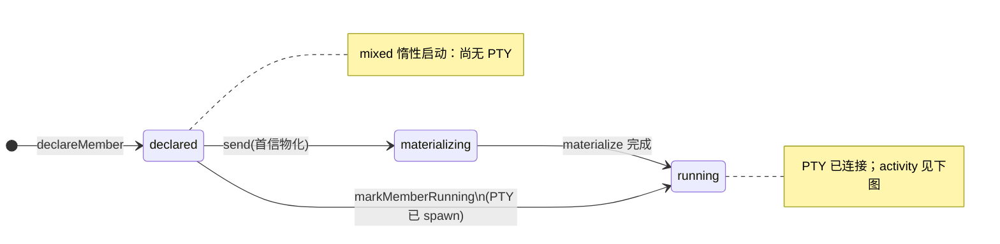
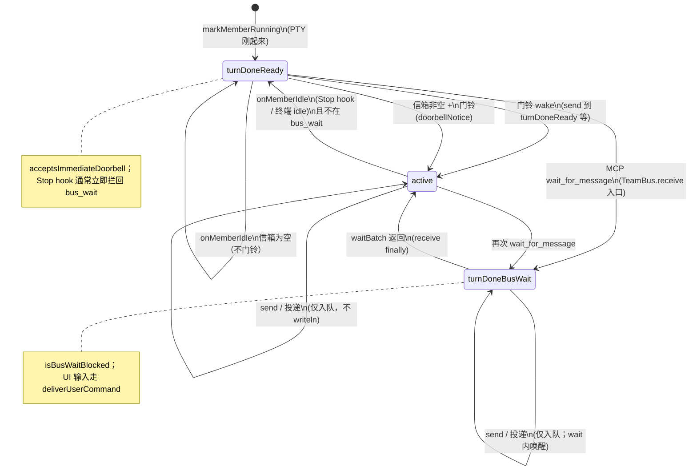
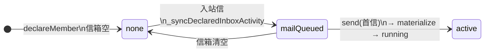
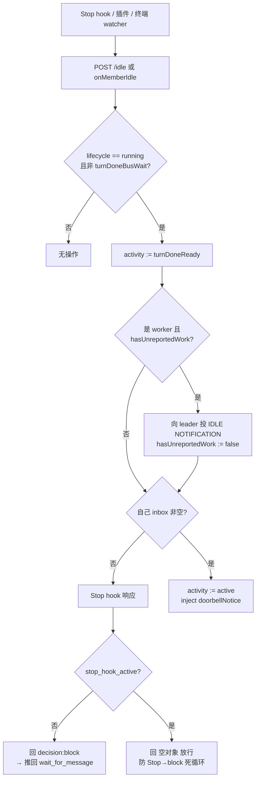

# TeamBus 成员状态机

mixed 模式下，每个队友在 [TeamBus](../client/lib/services/team_bus/team_bus.dart) 里对应一个 [AgentNode](../client/lib/services/team_bus/agent_node.dart)，用两条正交轴 + 一个工作闩锁描述：

| 字段 | 类型 | 含义 |
|------|------|------|
| **Lifecycle** | [MemberLifecycle](../client/lib/services/team_bus/member_state.dart) | PTY / 进程是否存在 |
| **Activity** | [MemberActivity](../client/lib/services/team_bus/member_state.dart) | CLI 是否在 turn、是否阻塞在 `wait_for_message` |
| **hasUnreportedWork** | `bool`（[AgentNode](../client/lib/services/team_bus/agent_node.dart)） | 是否有「已派给它、尚未向 leader 汇报完成」的工作 |

转移由 `TeamBus`、`ChatCubit` PTY 回调、MCP `wait_for_message`、Stop `/idle` hook 共同驱动。源码枚举见 `client/lib/services/team_bus/member_state.dart`。

**进程隔离**：每个 mixed 成员是**独立 CLI 进程**，CONFIG_DIR 隔离在
`config-profiles/teams/{teamId}/members/{cliTeamName}/{memberId}/{tool}/`
（见 [cli_data_layout.dart](../client/lib/services/cli/cli_data_layout.dart)）。
teammate-bus 的 MCP 配置 + `X-Member`、settings、Stop hook、transcripts 因此互不覆盖——
非 mixed 的 Claude agent-teams 仍共用 `members/{cliTeamName}/{tool}/` 单目录。

英文版：[TEAM_BUS_MEMBER_STATE.en.md](TEAM_BUS_MEMBER_STATE.en.md)

## 1. Lifecycle（PTY / roster）

## 2. Activity（`running` 时主循环）

> **稳态**：开了 Stop 拦截后，成员 turn 一结束就被 `/idle` 拦回 `wait_for_message`，
> 所以 `turnDoneReady` 通常是**瞬态**——成员在 `active`（处理中）与 `turnDoneBusWait`（驻留等待）之间循环。

## 3. Activity（`declared`，尚无 PTY）

## 4. idle 上报、门铃、Stop 拦截

成员「停下来」有三种检出来源，最终都汇入 `TeamBus.onMemberIdle`：

| 来源 | 适用 CLI | 能否拦截停止 |
|------|----------|------|
| `hooks.Stop` → POST `/idle`（http hook） | claude、flashskyai | **能**（响应回 `decision:block`） |
| idle 插件 `session.next.step.ended` → POST `/idle` | opencode | 否（事后通知，无法阻止停止） |
| 终端 watcher `ChatCubit._tickIdleWatch`（1s 检测 working→idle 边沿） | 全部（兜底） | 否 |

**当前策略**

- **Stop 拦截（全员，含 leader）**：`/idle` 响应回
  `{"decision":"block","reason":"…call wait_for_message…"}`，把成员拦在停止前、推回
  `wait_for_message`，常驻 bus（与「never stand down，关 tab 才散」一致）。
  CLI 再入时带 `stop_hook_active=true`，此时回 `{}` 放行，避免死循环。
- **门铃**：仅当自己信箱**有未读**时才 `wake` 并注入 `doorbellNotice`；空信箱只落 `turnDoneReady`。
- **向 leader 汇报**：worker 仅在 `hasUnreportedWork` 为真时投 `IDLE NOTIFICATION`，投完清零——
  **每批派活只报一次**；从未被派活的 worker（刚启动就 idle）**不打扰** leader；
  `hasUnreportedWork` 在任意入站信（`_deliverToInbox` / 恢复未读）时置位。

## 5. 组合速查（`list_teammates` → `busPhaseLabel`）

| lifecycle | activity | bus.phase |
|-----------|----------|-----------|
| running | active | in_turn |
| running | turnDoneReady | turn_done · ready |
| running | turnDoneBusWait | turn_done · bus_wait |
| declared | mailQueued | no_pty · mail_queued |
| declared | none | offline |

## 相关代码

| 模块 | 路径 |
|------|------|
| 枚举与 `busPhaseLabel` | `client/lib/services/team_bus/member_state.dart` |
| 状态转移、leader 汇报、门铃 | `client/lib/services/team_bus/team_bus.dart` |
| `acceptsImmediateDoorbell`、`hasUnreportedWork` | `client/lib/services/team_bus/agent_node.dart` |
| MCP 工具 + Stop `/idle` 响应 | `client/lib/services/team_bus/mcp/teammate_bus_mcp_handler.dart`、`teammate_bus_mcp_server.dart` |
| Stop hook 写入（claude/flashskyai 共享） | `client/lib/services/cli/registry/config_profile/bus_idle_stop_hook.dart` |
| 进程 CONFIG_DIR 隔离 | `client/lib/services/cli/cli_data_layout.dart` |
| mixed 角色说明 | `client/lib/services/session/member_role_provision.dart` |
