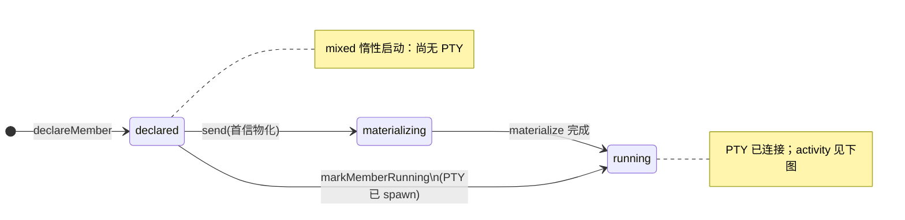
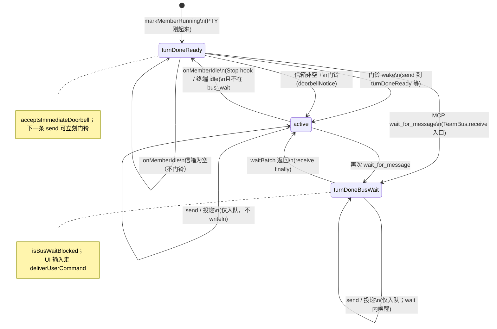
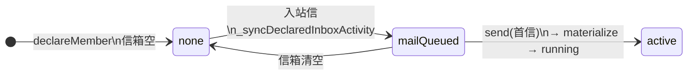
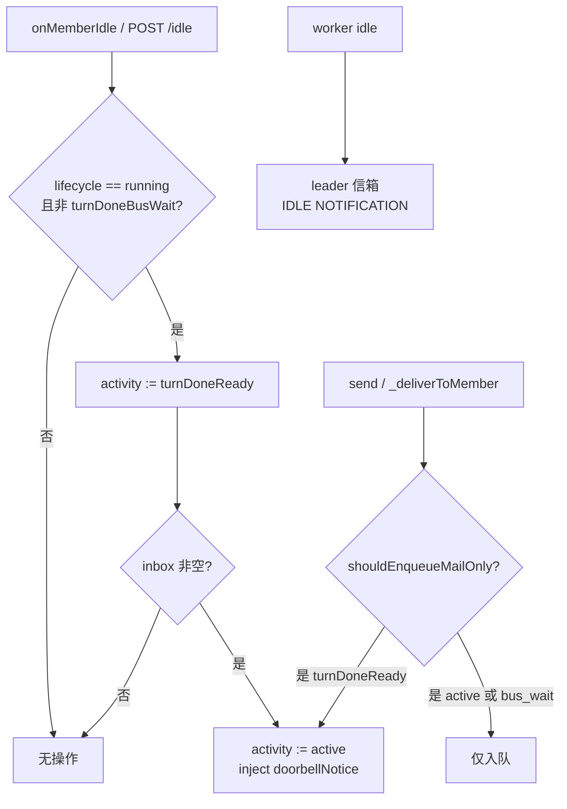

# TeamBus 成员状态机

mixed 模式下，每个队友在 [TeamBus](../client/lib/services/team_bus/team_bus.dart) 里对应一个 [AgentNode](../client/lib/services/team_bus/agent_node.dart)，用两条正交轴描述：

| 轴 | 类型 | 含义 |
|----|------|------|
| **Lifecycle** | [MemberLifecycle](../client/lib/services/team_bus/member_state.dart) | PTY / 进程是否存在 |
| **Activity** | [MemberActivity](../client/lib/services/team_bus/member_state.dart) | CLI 是否在 turn、是否阻塞在 `wait_for_message` |

转移由 `TeamBus`、`ChatCubit` PTY 回调、MCP `wait_for_message` 驱动。源码枚举定义见 `client/lib/services/team_bus/member_state.dart`。

英文版：[TEAM_BUS_MEMBER_STATE.en.md](TEAM_BUS_MEMBER_STATE.en.md)

## 1. Lifecycle（PTY / roster）

## 2. Activity（`running` 时主循环）

## 3. Activity（`declared`，尚无 PTY）

## 4. 门铃与 idle 边

**门铃策略（当前实现）**

- 仅当信箱**有未读**时才 `wake` 并注入 `doorbellNotice`。
- 信箱为空时 `onMemberIdle` 只落到 `turnDoneReady`，**不**往 PTY stdin 塞协调提示。
- Worker turn 结束会向 team-lead 投递 `IDLE NOTIFICATION`（与门铃独立）。

## 5. 组合速查（`list_teammates` → `busPhaseLabel`）

| lifecycle | activity | bus.phase |
|-----------|----------|-----------|
| running | active | in_turn |
| running | turnDoneReady | turn_done · ready |
| running | turnDoneBusWait | turn_done · bus_wait |
| declared | mailQueued | no_pty · mail_queued |
| declared | none | offline |

## 相关代码

| 模块 | 路径 |
|------|------|
| 枚举与 `busPhaseLabel` | `client/lib/services/team_bus/member_state.dart` |
| 状态转移 | `client/lib/services/team_bus/team_bus.dart` |
| `acceptsImmediateDoorbell` 等 | `client/lib/services/team_bus/agent_node.dart` |
| MCP 工具 | `client/lib/services/team_bus/mcp/teammate_bus_mcp_handler.dart` |
| mixed 角色说明 | `client/lib/services/session/member_role_provision.dart` |
