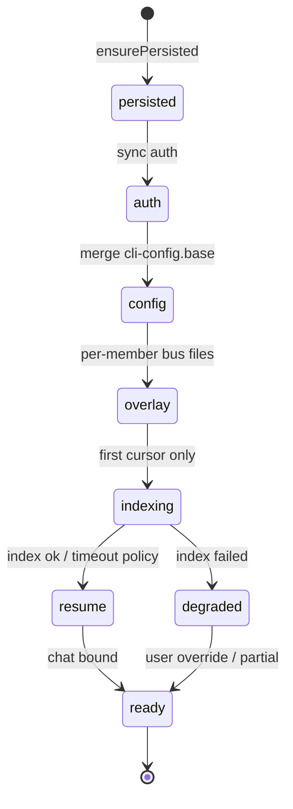

# CLI Session Lifecycle：分层持久化与分阶段初始化

> 状态：**草案** · 日期：2026-07-07  
> 背景：TeamPilot 嵌入的 cursor-agent 频繁 **Reconnecting**，本地终端单开 `agent` 稳定；mixed 4×cursor 冷启动索引 + 多路 HTTP/2 并发  
> 相关代码：`cursor_config_profile_capability.dart`、`cursor_home_provisioner.dart`、`config_profile_service.dart`、`session_lifecycle_service.dart`、`tab_team_bus_coordinator.dart`、`runtime_layout.dart`、`cursor_auth_artifacts.dart`  
> 关联设计：[2026-07-07-mailbox-delivery-state-design.md](./2026-07-07-mailbox-delivery-state-design.md)（PTY doorbell 与 Presence 解耦，**正交**）

## 1. 问题陈述

### 1.1 现象

1. **本地终端** `agent`：HTTP/2 `default_http2` 正常，对话稳定。  
2. **TeamPilot 嵌入终端**（同机、同代理）：cursor TUI 频繁 `Connection lost / Reconnecting`。  
3. 磁盘证据（Superpowers Quartet，`bab47ba7…` 会话）：
   - 每成员独立 `runtime/{member}/cursor/home/.cursor/`，**冷启动全仓 merkle 索引**；
   - `worker.log`：`Indexing failed … socket hang up`；
   - 4 路 agent 流 + 4 路索引并发，经 Clash HTTP/2 易被掐断。

### 1.2 根因（架构层）

今天 launch 路径把 **三件不同的事** 混在 `contributeLaunch` 一次性做完：

| 概念 | 今天怎么做 | 问题 |
|------|------------|------|
| **写配置**（mcp、rules、hooks） | `CursorHomeProvisioner` 每次重写 | 合理但应与「温层」分离 |
| **冷启动运行时**（索引、serverConfig、statsig） | 每成员假 HOME 从零开始 | **N 倍网络与磁盘** |
| **允许连 PTY** | `scheduleMemberConnect` 无门控 | 索引进行中即对话 → 抢连接 |

`ConfigProfileCapability.ensureSessionProfile` 对 cursor 是 **空实现**；`SessionResumeCapability` 只 resume chat id，**不**管索引/认证/网络缓存是否就绪。

### 1.3 本设计范围

**纳入：**

- 新 registry capability：**`CliSessionLifecycleCapability`**（持久化 + 初始化状态机）
- **状态分类 × 共享粒度**表（§4）— 不仅 `projects/`
- 磁盘布局：`session/_shared/{tool}/` 温层 + `session/{member}/{tool}/` 私有层（§6）
- Manifest：`init.json` schema 与 phase 机（§7–§8）
- 挂接点：`config_profile_service`、`session_lifecycle_service`、`tab_team_bus_coordinator`（§9）
- **Phase A** cursor 实现；其他 CLI 契约 + 后续扩展点（§11）
- SSH / 工作面路径约束（§12）

**不纳入（另文或后续）：**

- Mailbox pull-first / team-lead 跳过 doorbell（mailbox 长期项，与 lifecycle **互补**）
- Workspace 级跨 session 索引缓存（Phase C 可选）
- Headless 预索引 CLI（`cursor-agent -p` warmup）

---

## 2. 术语

| 术语 | 含义 |
|------|------|
| **温层（warm tier）** | session 级只读或可 merge 的 CLI 运行时数据，跨成员、跨 reopen 复用 |
| **私有层（private tier）** | member 级必须隔离的数据（chats、bus mcp 身份、role） |
| **Manifest** | `runtime/_shared/{tool}/init.json`，记录 phase、共享路径、成员绑定 |
| **Phase** | 初始化状态机：`persisted` → `auth` → `config` → `overlay` → `index` → `resume` → `ready` |
| **门控（gate）** | PTY `connect` 前必须 `phase >= ready`（或显式 `degraded` 策略） |
| **Overlay** | member 级 bus 生成文件（mcp、rules、hooks），每次 launch 可重写但依赖温层 |

---

## 3. 背景：现有能力与缺口

```
app → identity → workspace → session → member
         ↑           ↑          ↑         ↑
   ConfigProfile   plugins   contributeLaunch  SessionResume
   ensureSession*  inherit   (env only)        (chat id)
```

| 能力 | 职责 | cursor 缺口 |
|------|------|-------------|
| `ConfigProfileCapability` | 写配置树、launch env | `ensureSessionProfile` 空；`contributeLaunch` 兼做 provision + trust |
| `SessionResumeCapability` | `--resume` chat id | 不感知索引是否完成 |
| `RuntimeLayout.ensureSessionRuntimeInherits*` | `agents/` 继承 | 未覆盖 `.cursor/projects` 等温层 |
| `CursorAuthArtifacts` | 区分 bus 生成 vs auth 文件 | 未上升为 lifecycle 契约 |

**原则：** `ConfigProfile` 继续负责 **配置内容与 env**；`CliSessionLifecycle` 负责 **哪些状态跨 reopen 存活、何时预热、何时允许 PTY**。

---

## 4. 状态分类 × 共享粒度（核心模型）

### 4.1 Cursor（`$HOME` 隔离树）

| 状态 | 典型路径 | 粒度 | 策略 |
|------|----------|------|------|
| OAuth token | `.config/cursor/auth.json` | **session** | 从全局 sync 一次；member symlink 或 refresh-on-stale |
| Server / 网络缓存 | `cli-config.json` → `serverConfigCache`, `network` | **session** | merge 用户真实 `~/.cursor/cli-config.json` 基底 + member 覆盖 |
| 权限模板 | `cli-config.json` → `permissions`（非 bus 项） | **session** base + **member** merge | base 含通用 allow；member 加 `Mcp(teammate-bus:*)` |
| 工作区索引 | `.cursor/projects/<slug>/` | **session** + workspace path hash | **共享只读**；单 worker 索引 |
| Workspace trust | `projects/<slug>/.workspace-trusted` 等 | **session** | 随 projects 共享 |
| Statsig / feature flags | `statsig-cache.json` | **session** | 共享，减冷启动拉取 |
| Agent CLI 杂项 | `agent-cli-state.json` | **member** | 私有 |
| 对话 | `chats/<ws-hash>/<chat-id>/` | **member** | 私有；manifest 记 `chatId` |
| Bus MCP | `mcp.json` | **member** | overlay；含 `X-Member`、端口/token |
| Role rule | `rules/role.mdc` | **member** | overlay |
| Stop hook | `hooks.json`, `hooks/idle.sh` | **member** | overlay；idle URL 随 tunnel 变 |
| Skills 同步 | `skills-cursor/` | **session** 或 workspace | 优先 inherit workspace/app；避免每成员各 sync |
| TeamPilot plugins | `runtime/.../plugins/` | 已有 inherit | 不变 |

`CursorAuthArtifacts.busGenerated` 列表 = **必须 per-member overlay**，不可放入温层。

### 4.2 其他 CLI（契约占位，Phase B+）

| CLI | session 温层 | member 私有 |
|-----|-------------|-------------|
| claude | project settings 模板、plugin pool 引用 | `CLAUDE_CONFIG_DIR`、bus stdio bridge argv |
| codex | `config.toml` 模板 | `CODEX_HOME/sessions/`、member bus |
| opencode | 共享 data 中非 session 部分 | `OPENCODE_DATA_DIR` per member |
| flashskyai | `settings.json` / metadata 默认值 | session home dir、member role |

各工具实现 `CliSessionLifecycleCapability`；registry 无实现则 **no-op**（与今天行为一致）。

---

## 5. 方案比选

### 方案 A：仅 symlink `projects/`（最小）

- 优点：改动小  
- 缺点：不解决 `serverConfigCache` 冷拉、auth 重复、4 路同时 connect；**不够**

### 方案 B：整棵假 HOME 持久化（最大）

- 优点：简单直觉  
- 缺点：bus overlay（mcp 端口、member id）会泄漏；SSH tunnel 重建后 stale；**隔离边界错误**

### 方案 C：分层温层 + member overlay + init 状态机（推荐）

- 优点：对齐 `CursorAuthArtifacts` 分类；可门控；可扩展到其他 CLI  
- 缺点：实现量中等；需 manifest 与锁  

**结论：采用方案 C。**

---

## 6. 磁盘布局

在现有 `workspace/.../sessions/{sessionId}/runtime/` 下增加 `_shared`：

```
runtime/
  _shared/
    cursor/
      init.json                 # manifest（§7）
      cli-config.base.json      # serverConfigCache, network, 非 bus permissions
      statsig-cache.json        # 可选
      projects/
        <workspace-slug>/       # 索引 + trust（symlink 目标）
    # 未来: claude/, codex/, …
  team-lead/
    cursor/
      home/                     # 假 HOME 根（仅私有 + symlink 入口）
        .config/cursor/         # auth → ../../_shared/cursor/auth 或 session 级 auth/
        .cursor/
          cli-config.json       # merge(base, member-overrides.json)
          chats/                # 私有
          mcp.json              # overlay
          rules/                # overlay
          hooks/                # overlay
          projects/             # → symlink ../../../_shared/cursor/projects/
  architect/
    cursor/ ...
```

**路径 API（新增）：**

```dart
// WorkspaceLayout / RuntimeLayout
String sessionRuntimeSharedToolDir(workspaceId, sessionId, tool);
String sessionLifecycleManifestPath(workspaceId, sessionId, tool);
```

**工作面：** 上述路径均在 **session 所属 workspace 的 work plane** 上解析（与 [P1+P2 runtime context](./2026-06-22-p1-p2-runtime-context-design.md) 一致），SSH 成员索引在远程机 `_shared` 落地，非控制面本机。

**继承链扩展：** `ensureSessionRuntimeInheritsWorkspace` 之后、`contributeLaunch` 之前，lifecycle 确保 `_shared/{tool}/` 存在并更新 manifest。

---

## 7. Manifest schema（`init.json`）

```json
{
  "schemaVersion": 1,
  "tool": "cursor",
  "workspaceId": "45e55e65-...",
  "sessionId": "bab47ba7-...",
  "workspacePathHash": "home-hhoa-git-hhoa-teampilot",
  "workspaceSlug": "home-hhoa-git-hhoa-teampilot",
  "phase": "ready",
  "phaseUpdatedAtMs": 1783400000000,
  "shared": {
    "root": "runtime/_shared/cursor",
    "projectsDir": "runtime/_shared/cursor/projects/home-hhoa-git-hhoa-teampilot",
    "cliConfigBase": "runtime/_shared/cursor/cli-config.base.json",
    "authDir": "runtime/_shared/cursor/auth"
  },
  "index": {
    "leaderMemberId": "architect",
    "startedAtMs": 1783399900000,
    "finishedAtMs": 1783400000000,
    "lastError": null
  },
  "members": {
    "team-lead": {
      "homeRoot": "runtime/team-lead/cursor/home",
      "overlayGeneration": 2,
      "chatId": "f4950284-7dcd-4655-9af3-9a2120ba24d4",
      "resumeCapturedAtMs": 1783400100000
    }
  }
}
```

| 字段 | 说明 |
|------|------|
| `phase` | §8 状态机当前阶段；`ready` 才默认允许 connect |
| `index.leaderMemberId` | 首个跑索引的成员；其他成员等待 |
| `overlayGeneration` | bus 端口/token 变更时递增；用于检测 stale overlay |
| `chatId` | 供 `SessionResumeCapability` 读取，减少每次 scan `chats/` |

---

## 8. 初始化状态机



| Phase | 动作 | 失败策略 |
|-------|------|----------|
| `persisted` | 建 `_shared` + member 树；symlink `projects/` | 阻塞 |
| `auth` | `CursorProviderCredentialsService.syncAuthToMemberHome` → session 级 auth | 警告 + 阻塞 connect |
| `config` | 从用户全局 `cli-config.json` merge `serverConfigCache`/`network` → `cli-config.base.json` | 降级：空 base |
| `overlay` | `CursorHomeProvisioner` 只写 bus 文件；merge member `cli-config.json` | 警告 |
| `indexing` | 仅 `leaderMemberId` 启动 PTY 或 headless 触发索引；监视 `worker.log` 或超时 | → `degraded` |
| `resume` | 读/写 manifest `chatId`；对接 `SessionResumeCapability` | 无 chat 则新会话 |
| `ready` | 允许 `scheduleMemberConnect`（非 leader 成员） | — |
| `degraded` | 索引失败但允许对话（显式策略，UI 可提示） | 用户可选等待重试 |

**并发：** session 级 `synchronized` 锁（复用 `RuntimeLayout` inherit lock 模式），防止多成员同时写 `_shared`。

**超时建议：** `indexing` 默认 10min（大仓可配置）；超时 → `degraded`，不无限阻塞团队启动。

---

## 9. `CliSessionLifecycleCapability` 接口

```dart
/// Tool-specific session persistence and phased initialization.
abstract interface class CliSessionLifecycleCapability implements CliCapability {
  /// Create warm tier dirs, symlinks, manifest; idempotent.
  Future<CliSessionPersistResult> ensurePersisted(CliSessionPersistContext ctx);

  /// Run phase machine up to [targetPhase] or until blocked.
  Future<CliSessionInitResult> initialize(
    CliSessionInitContext ctx, {
    CliSessionPhase targetPhase = CliSessionPhase.ready,
  });

  /// Session/tab close or member dispose: flush manifest, optional checkpoint.
  Future<void> finalize(CliSessionFinalizeContext ctx);

  /// Whether PTY connect is allowed for this member right now.
  CliSessionGateDecision gateConnect(CliSessionGateContext ctx);
}
```

**Context 字段（摘要）：** `workspaceId`, `sessionId`, `memberId?`, `tool`, `paths`（work plane）, `team`, `busIdle?`, `workingDirectory`, `crossMachine`.

**`CliSessionInitResult`：** `phase`, `warnings[]`, `blocked`（是否门控 connect）.

**Registry：** `CliToolRegistry.capability<CliSessionLifecycleCapability>(cli)`；缺省 **no-op**（`gateConnect` 恒 `allow`）。

### 9.1 与现有能力的分工

| 步骤 | 负责方 |
|------|--------|
| 磁盘目录 + manifest + symlink | `CliSessionLifecycle.ensurePersisted` |
| merge cli-config base | lifecycle `config` phase |
| bus mcp/rules/hooks | lifecycle 调 `CursorHomeProvisioner`（瘦身后） |
| launch env `HOME`/`CURSOR_CONFIG_DIR` | 仍由 `contributeLaunch` 返回；paths 来自 manifest |
| `--resume` | `SessionResumeCapability` 读 manifest `chatId` 优先 |
| PTY connect 时机 | `gateConnect` ← `tab_team_bus_coordinator` / `session_launch_service` |

### 9.2 挂接点

1. **`ConfigProfileService.ensureSessionProfile`**  
   在 `cap.ensureSessionProfile` **之后**调用 `lifecycle.ensurePersisted`（或合并调用顺序：persist → config profile → initialize）。

2. **`SessionLifecycleService` / `SessionLaunchService`**  
   `scheduleMemberConnect` 前：`await lifecycle.initialize(...)`；`gateConnect` 为 `deny` 则排队/显示 booting。

3. **`TabTeamBusCoordinator.materializeMember`**  
   已有 `ensureMemberInputReady`；增加「lifecycle phase >= ready」条件（与 PTY connected 并列）。

4. **`CursorConfigProfileCapability`**  
   - `ensureSessionProfile` 迁空或委托 lifecycle；  
   - `contributeLaunch` 缩减为 **读 manifest 路径 + 返回 env**，不再每次 `ensureDir` 全树。

---

## 10. Cursor 实现要点（Phase A）

### 10.1 `ensurePersisted`

1. 计算 `workspaceSlug`（复用 `CursorWorkspaceTrust` / `workspacePathHash` 逻辑）。  
2. 创建 `_shared/cursor/{projects,auth}`。  
3. 对每个 mixed member：创建 `home/`，symlink `projects` → shared。  
4. 写入/更新 `init.json`（`phase: persisted`）。

### 10.2 `initialize`

1. **auth**：session 级 sync 一次；member `.config/cursor` symlink 或 copy-on-first-use。  
2. **config**：读用户真实 `~/.cursor/cli-config.json`（`CursorHomeLayout.globalAuthJsonCandidates` 同机路径），提取 `serverConfigCache`、`network` 写入 base；**不**覆盖 bus permissions。  
3. **overlay**：`CursorHomeProvisioner.provision` 仅 `busGenerated` 路径；`cli-config.json` = merge(base, member permissions)。  
4. **indexing**：若 `projects/<slug>/` 无完成标记且尚无 leader，当前 member 成为 leader 并 connect；其他成员 `gateConnect` = deny until `ready`。完成判据：`worker.log` 出现 `Indexing finished` 或超时 → `degraded`。  
5. **resume**：`CursorResumeStrategy.detectNativeId` 结果写入 manifest。

### 10.3 `gateConnect`

- `phase == ready` → allow  
- `phase == indexing` && member != leader → deny（booting）  
- `phase == degraded` → allow + warning flag（可配置为 deny）  
- `overlayGeneration` 与 bus 注册不一致 → 先 `overlay` 再 allow  

### 10.4 网络 env（可选 Phase A.1）

在 `contributeLaunch` env 追加（不写入磁盘）：

- `NODE_USE_ENV_PROXY=1`（若 host 有 proxy）  
- `no_proxy` 含 `cursor.sh,cursorapi.com,localhost,127.0.0.1`  

---

## 11. 分阶段交付

### Phase A — cursor + mixed 团队（本期）

- [ ] `CliSessionLifecycleCapability` 接口 + no-op 默认  
- [ ] `WorkspaceLayout.sessionRuntimeSharedToolDir`  
- [ ] `CursorSessionLifecycleCapability`（persist + init + gate）  
- [ ] 挂接 `session_launch_service` 门控  
- [ ] 单测：manifest 读写、merge cli-config、gate 逻辑  
- [ ] 集成：2×cursor 会话，断言仅 1 路 indexing  

**预期：** Reconnecting 频率显著下降；reopen 会话索引复用。

### Phase B — personal standalone + 其他 CLI 契约

- [ ] personal cursor 走同一温层（无 member 时 `members` 仅 `default`）  
- [ ] claude/codex lifecycle stub + `CODEX_HOME` / `CLAUDE_CONFIG_DIR` 温层设计落地  
- [ ] `finalize` 刷 manifest `chatId`  

### Phase C — 可选增强

- [ ] workspace 级跨 session projects 缓存（TTL + path hash 校验）  
- [ ] UI：成员 booting 显示 `indexing` / `degraded`  
- [ ] headless 预索引命令  
- [ ] 与 mailbox pull-first 联调（减少 doorbell 并发 turn）  

---

## 12. SSH / 远程成员

1. **温层路径**必须在成员 **work plane**（远程 `runtime/_shared`），symlink 在远程假 HOME 内解析。  
2. **bus overlay** 依赖 `MemberBusIdleEndpoint` 端口/token；tunnel 重建后 `overlayGeneration++`，强制 overlay 阶段重跑，**不**复用 stale `mcp.json`。  
3. **index leader** 应在「持有 workspace 目录」的机器上跑索引（通常即远程 builder）；控制面仅 orchestrate。  
4. `RemoteConnectionStatus != connected` 时 `gateConnect` = deny，与 SSH reconnect 对齐。

---

## 13. 测试策略

| 层级 | 内容 |
|------|------|
| 单测 | manifest round-trip；cli-config merge；`gateConnect` 各 phase；overlay generation |
| 单测 | symlink `projects` 在 fake fs 上可解析 |
| 集成 | 2 member cursor：leader 索引期间 follower connect 被门控 |
| 集成 | reopen session：第二次无 merkle 全量（worker.log 行数阈值） |
| 手工 | Superpowers Quartet 4×cursor：对比 Reconnecting 次数与 worker.log |

---

## 14. 开放问题

1. **index 完成判据**是否只信 `worker.log` 字符串？备选：文件系统 heuristic（`projects/<slug>/` 某 marker 文件）。  
2. **`degraded` 默认 allow 还是 deny connect？** 建议 allow + UI 警告（团队会话不应被索引卡死）。  
3. **auth session 级 copy vs symlink**：Windows / SSH 上 symlink 权限；可能需 copy + mtime 刷新。  
4. **leader 选举**：固定 roster 顺序 vs 谁先 `initialize`；失败时是否切换 leader。  
5. **销毁会话**：`destroyCliState` 是否保留 `_shared` 供 reopen（建议 **保留**，除非用户「清除会话数据」）。

---

## 15. 小结

| 问题 | 答案 |
|------|------|
| 只持久化 `projects/` 够吗？ | **不够**；auth、serverConfig、statsig、skills 等应 session 温层共享 |
| 整棵 HOME 持久化？ | **不行**；bus overlay 必须 per-member |
| 与 ConfigProfile 关系？ | Config 写内容；Lifecycle 管存活、预热、门控 |
| 与 MailboxDelivery 关系？ | **正交**；lifecycle 减网络负载，mailbox 减 PTY doorbell 干扰 |
| 首选实现？ | 方案 C：`_shared` + manifest + `CliSessionLifecycleCapability` + connect 门控 |

---

## 16. 参考日志与配置（2026-07-07）

- TeamPilot isolated `cli-config.json` 已含正确 `serverConfigCache` / `agentUrl`，但每成员仍冷启动索引。  
- `architect/.../worker.log`：`Indexing failed … socket hang up`。  
- 用户本地 `~/.cursor/cli-config.json`：`network.useHttp1ForAgent: false`（与 TeamPilot 一致，非根因）。
